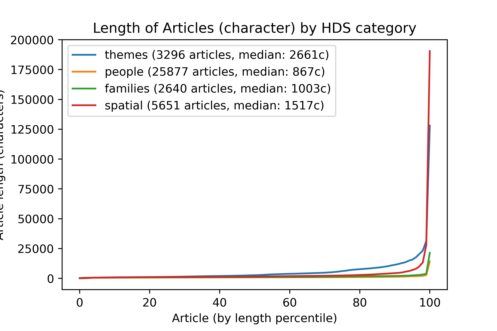
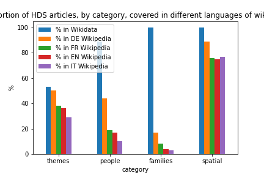

<link rel="stylesheet" type="text/css" href="./style.css">

# Linking the DHS

## 1) Introduction

The Historical Dictionary of Switzerland (HDS) is a valuable source for historians and the general public on the History of Switzerland. It is the result of 30 years of dedicated work by historians with a vision for a detailed encyclopedia of Switzerland. Today it boasts a growing collection of 36'000 articles.

It was also at the forefront of the transition to the digital medium with its first online version in 2006. It is actively participating in the push for linked data as part of the metagrid.ch consortium. Today, it serves as a reference for both Wikipedia and Wikidata, with Wikidata linking entities to most of its articles.

The Dictionary was intended for publication as a paper encyclopedia. Its digital twin has been an evolution from this format. As a result, it still lacks some features that are hallmarks of born-digital encyclopedias.

Notably, cross-linking is a defining feature of Wikipedia. On a Wikipedia page, any entity that has its own article is directly linked to this article, offering an easy and enticing exploration experience.

Cross-linking of articles is currently in the process of being implemented in HDS articles. This project aims at making this process faster by automating using NLP techniques.

In this project, we will perform automated named entity recognition and disambiguation on the whole HDS, use it to link the articles among themselves as well as to Wikipedia and provide a demonstration interface for a linked HDS.

The rest of this report is organized as follows: in section 2) an overview of the HDS is given with summary statistics; in section 3) the methodology and techologies used are presented; in section 4), the results, evaluation and statistics are presented; finally, section 5) concludes and proposes future avenues to continue this work.

## 2) The Historical Dictionary of Switzerland

The [Historical Dictionary of Switzerland](hls-dhs-dss.ch/) offers more than 36'359 articles in 3 languages, Italian, German and French. It offers a search interface and articles are classified in 4 main categories: people, families, spatial (municipalities, regions, etc.) and themes (communism, contemporary art, etc.).
Most articles are about people (25'291 articles), then come spatial (5'459 articles), themes (3'154) and finally families (2'557).

A HDS article has many components:
1) article text
2) media components (images, maps, data tables)
3) a list of historical and bibliographic sources
4) links to the same entity on other linked databases (GND, metagrid, Swiss diplomatic documents, etc.)
5) structured data (birth and death dates, alternative names, etc.)
6) thematic indexation (categories such as "Elites before 1800", "Cantonal parliaments", etc.)

Components "1) article text", "3) sources" and "6) thematic indexation" are present in all articles. Component "4) links to other linked databases" is present in most articles while presence of the components "2) media" and "5) structured data" vary a lot.

Two examples of articles with most of the above components are the [city of Zurich](https://hls-dhs-dss.ch/articles/000171) and [Gustave Ador](https://hls-dhs-dss.ch/articles/003848/). [Schneckenbundgericht](https://hls-dhs-dss.ch/articles/029462/2016-11-23/) or [Schmerikon](https://hls-dhs-dss.ch/articles/001373/2011-08-10/) are typical sparse articles, without external links, media or structured data.

All articles are versioned, for example as of this report Bioley-Orjulaz just got updated from a [2004 version](https://hls-dhs-dss.ch/articles/002356/2004-09-30/) to [a new one](https://hls-dhs-dss.ch/articles/002356/2021-11-08/) with cross-linking. It clearly shows that the question of cross-linking is currently being adressed at the HDS, at the same time this project has been going.

Most articles are quite short, consisting of a single paragraph, while a few articles are much longer. As can be seen in figure figXXX, articles about themes are longer on average. While spatial articles are the longest.

The HDS is used as a source by Wikipedia and Wikidata. The coverage in Wikidata in particular is very good with 88% of HDS articles having a Wikidata entity linking to them. Regarding Wikipedia, 49% of HDS articles have a corresponding article in the German Wikipedia, for French and Italian the coverage is 28% and 20% respectively. Breaking those statistics further by category as in figure figXXX yields new insights: spatial articles are very well covered in all Wikipedias; families and people are well covered in Wikidata but not so in Wikipedia; themes are somewhere in between with a medium coverage in both Wikidata and Wikipedia. The most interesting result for the rest of our work is the much better coverage of people in the German Wikipedia at 44%.

## 3) Methodology

The main steps of the projects are as follows:
1) downloading the whole HDS;
2) doing named entity recognition and disambiguation;
3) augmenting the HDS articles with the recognized entities; 
4) creating a demonstration interface for a linked HDS.

### 3.1) HDS articles extraction

We created a python scraper to download and parse the whole HDS.

Of the 6 type of components mentionned in section 1), the scraper gathers all of them except media components which are not central to this project.

### 3.2) Named Entity Recognition and Disambiguation with entity-fishing

The main task of this project is named entities recognition and disambiguation. Based on the result of the CLEF-HIPE 2020 challenge, we decided to use the [entity-fishing](https://github.com/kermitt2/entity-fishing/) entity recognition and disambiguation framework.

#### Results 16.12 on 16 documents:

*French*:
- TP: 606
- FP: 203
- FN: 216
Micro:
- precision: 0.749
- recall: 0.737
- F1: 0.743
Macro:
- precision: 0.748
- recall: 0.721
- F1: 0.729

*French with article title annotation*:
- TP: 551
- FP: 203
- FN: 209
Micro:
- precision: 0.731
- recall: 0.725
- F1: 0.728
Macro:
- precision: 0.731
- recall: 0.722
- F1: 0.719					

_German_:
- TP: 602
- FP: 295
- FN: 270
Micro:
- precision: 0.671
- recall: 0.69
- F1: 0.681
Macro:
- precision: 0.661
- recall: 0.66
- F1: 0.653

### 3.3) Demonstration Interface for a linked HDS

For this work

## 4) Results

## 5) Conclusion and future works